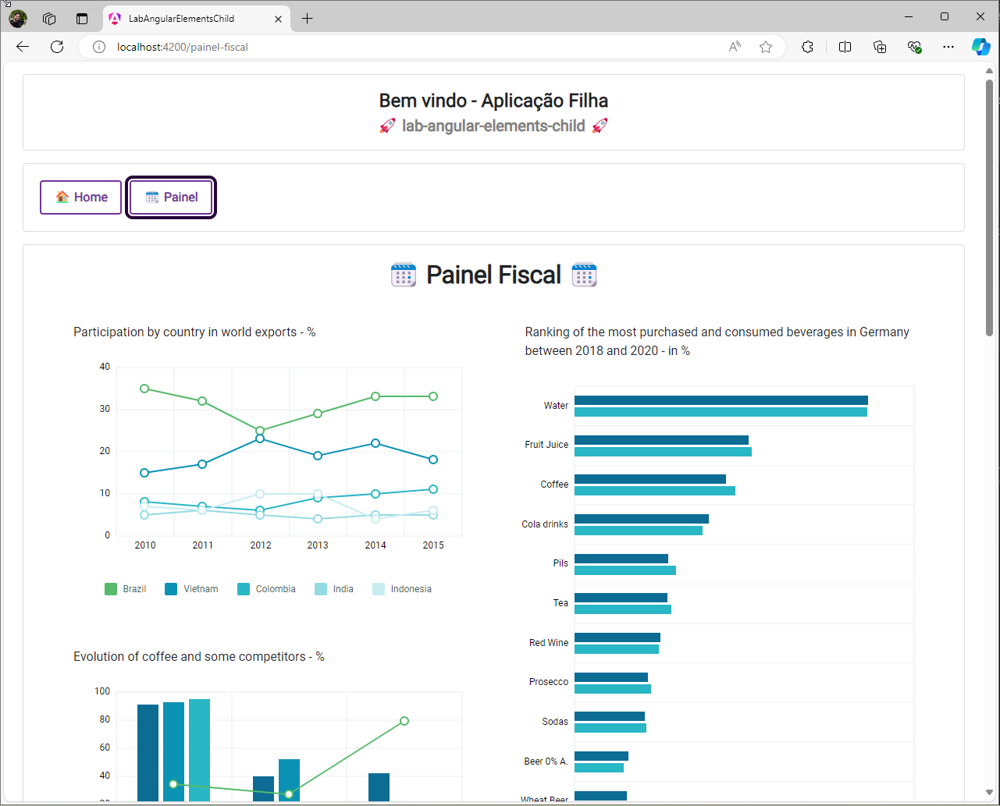

# Projeto LabAngularElementsChild

Este projeto Angular é um exemplo prático de como criar e utilizar elementos personalizados utilizando o Angular Elements.


## Clonar

Para clonar o projeto, execute o seguinte comando no terminal:

```bash
git clone https://github.com/ronanvaleoliveira/lab-angular-elements-child.git
```


## Instalação

Para instalar as dependências do projeto, execute o seguinte comando no diretório do projeto:

```bash
npm install
```


## Executar o Projeto

- Execute `ng serve lab-angular-elements-child` ou `npm rum start` para executar a aplicação em um servidor de desenvolvimento. 
- Navegue até `http://localhost:4200/`. 
- O aplicativo será recarregado automaticamente se você alterar algum dos arquivos de origem.

```bash
ng serve lab-angular-elements-child

npm rum start
```



## Build

Para fazer os builds do projeto, execute os seguintes comandos no diretório do projeto:


| COMANDO                       |  DESCRIÇÃO                                                                                                                        |
|-------------------------------|-----------------------------------------------------------------------------------------------------------------------------------|
| `npm rum buildprod`           | Executa o build de produção da aplicação, baseando-se nas configurações do projeto `"lab-angular-elements-child"`.                |
| `npm rum buildelementsprod`   | Executa o build de produção da aplicação, baseando-se nas configurações do projeto `"lab-angular-elements-child-elements"`.       |
| `npm rum buildelementsdev`    | Executa o build de desenvolvimento da aplicação, baseando-se nas configurações do projeto `"lab-angular-elements-child-elements"`.|

Para mais detalhes sobre o build e distribuição, consulte os projetos `lab-angular-elements-child` e `"lab-angular-elements-child-elements"` no arquivo `angular.json`


## Teste dos elementos customizados

A pasta `.testing-angular-elements` contém o arquivo `index.html` para testar os elementos criados neste projeto.

Para testar os elementos gerados no build de **Produção** `npm rum buildelementsprod` , copie os arquivos da lista abaixo e cole no diretório `"..\lab-angular-elements-child\.testing-angular-elements\lab-angular-elements-child"` 
- labangularelementschildelements.js
- styles.css
- Roboto-Regular.ttf
- Roboto-Bold.ttf
- Animalia.ttf
- Animalia.woff

Para testar os elementos gerados no build de **Desenvolvimento** `npm rum buildelementsdev` , copie os arquivos da lista abaixo e cole no diretório `"..\lab-angular-elements-child\.testing-angular-elements\lab-angular-elements-child"` 
- labangularelementschildelements.js
- styles.css
- Roboto-Regular.ttf
- Roboto-Bold.ttf
- Animalia.ttf
- Animalia.woff
- main.js.map
- styles.css.map


Abra o terminal no diretório `..\lab-angular-elements-child\.testing-angular-elements` e execute o seguinte comando:

```bash
http-server
```

Navegue para um dos endereços abaixo:
- http://172.20.128.1:8080
- http://192.168.1.100:8080
- http://127.0.0.1:8080
- http://172.24.48.1:8080


> **Observação:** Caso não tenha o servidor http instalado em sua máquina, execute o comando `npm install -g http-server`. Para mais detalhes, consulte a [documentação](https://www.npmjs.com/package/http-server)

